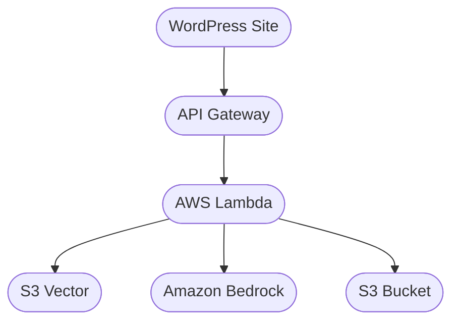

#  Urban Wildlife Alliance Chatbot


> RAG-powered chatbot built on Amazon Bedrock, FastAPI, and S3 Vectors — helping the Urban Wildlife Alliance provide expert, humane wildlife guidance to the public.

---

## Demo

```bash
curl -X 'POST' \
  'http://127.0.0.1:8000/Prod/v1/chatbot' \
  -H 'accept: application/json' \
  -H 'Content-Type: application/json' \
  -d '{
  "message": "I found an injured bat in my yard",
  "conversation_history": []
}'
```

The chatbot never answers from general internet knowledge — every response is grounded in the Urban Wildlife Alliance's approved guidance documents.

---

## Table of Contents

- [How It Works](#how-it-works)
- [Architecture](#architecture)
- [Tech Stack](#tech-stack)
- [Project Structure](#project-structure)
- [Prerequisites](#prerequisites)
- [Installation](#installation)
- [Environment Variables](#environment-variables)
- [Setup and Deployment](#setup-and-deployment)
- [Local Development](#local-development)
- [API Reference](#api-reference)
- [License](#license)

---

## How It Works

1. User sends a wildlife question via the WordPress site
2. The AI model (Nova-Micro) decides to call the `get_wildlife_guide` tool
3. The tool converts the question to a 1024-dimension vector using Titan Embed
4. S3 Vectors finds the most semantically similar wildlife guide document
5. That document is returned to Nova-Micro as context
6. Nova-Micro forms a response grounded entirely in that content
7. Response is sent back to the user

**What it does:**
- Answers humane wildlife conflict and emergency questions across 18+ urban species
- Maintains multi-turn conversation history
- Grounds every response in approved Urban Wildlife Alliance guidance only
- Integrates with the Urban Wildlife Alliance WordPress site via REST API

**What it never does:**
- Answer from general internet knowledge
- Recommend harming, poisoning, or relocating wildlife
- Provide veterinary treatment advice

---

## Architecture



The application is deployed as a single AWS SAM stack. The primary resources are:

- **`ChatbotApiFunction`** — Lambda function running FastAPI, handles all API requests
- **`RagVectorBucket` + `RagVectorIndex`** — S3 vector index storing 1024-dimension embeddings of wildlife guide documents
- **`InfoBucket`** — S3 bucket storing the raw wildlife guide text files
- **`API Gateway`** — Public HTTPS endpoint connecting WordPress to Lambda

The Lambda function has IAM permissions to invoke Bedrock models, query S3 Vectors, and read from the info bucket.

---

## Tech Stack

| Layer | Technology |
|---|---|
| AI Model | Amazon Bedrock — Nova-Micro v1 |
| Embeddings | Amazon Bedrock — Titan Embed Text v2 |
| Vector Search | AWS S3 Vectors |
| Document Storage | Amazon S3 |
| Backend Framework | FastAPI + Mangum |
| Runtime | AWS Lambda (Python 3.14) |
| API | Amazon API Gateway |
| Infrastructure | AWS SAM (CloudFormation) |

---

## Project Structure

```
urban-wildlife-alliance-chatbot/
│
├── chatbot_api/                            # Application code
│   ├── app.py                              # FastAPI entry point + Lambda handler
│   ├── requirements.txt                    # Python dependencies
│   └── chatbot_api/
│       ├── models.py                       # Pydantic request/response models
│       ├── aws/
│       │   ├── bedrock_runtime.py          # Bedrock client, converse, Titan embed
│       │   ├── s3.py                       # S3 bucket client and file retrieval
│       │   └── s3vectors.py               # S3 vector client and similarity search
│       └── endpoints/
│           └── v1/
│               ├── routes.py              # URL routing
│               ├── chatbot.py             # Chatbot logic, tool config, tool executor
│               └── health.py             # Health check endpoint
│
├── local_tooling/
│   └── s3_vector_init.py                  # One-time script to populate vector index
│
├── template.yaml                           # AWS SAM infrastructure definition
├── samconfig.toml                          # SAM deployment configuration
└── .gitignore
```

---

## Prerequisites

- [Python 3.14](https://www.python.org/downloads/)
- [AWS CLI](https://aws.amazon.com/cli/) configured with valid credentials
- [AWS SAM CLI](https://docs.aws.amazon.com/serverless-application-model/latest/developerguide/install-sam-cli.html)
- An AWS account with Bedrock model access approved for:
  - `amazon.nova-micro-v1:0`
  - `amazon.titan-embed-text-v2:0`

> ⚠️ Bedrock model access is not enabled by default. Request access through the [AWS Bedrock console](https://console.aws.amazon.com/bedrock) before deploying.

**Python packages** (installed via pip):

| Package | Purpose |
|---|---|
| `fastapi` | Web framework for building the API |
| `fastapi[standard]` | Standard extras including uvicorn for local serving |
| `mangum` | Wraps FastAPI to run on AWS Lambda |
| `pydantic` | Data validation for request and response models |
| `boto3` | AWS SDK — connects to Bedrock, S3, and S3 Vectors |

---

## Installation

**1. Clone the repository**

```bash
git clone https://github.com/JTexpo/urban-wildlife-alliance-chatbot.git
cd urban-wildlife-alliance-chatbot
```

**2. Create and activate a virtual environment**

```bash
# Windows
python -m venv .venv
.venv\Scripts\activate

# Mac / Linux
python -m venv .venv
source .venv/bin/activate
```

**3. Install dependencies**

```bash
pip install -r chatbot_api/requirements.txt
```

**4. Configure AWS credentials**

```bash
aws configure
```

---

## Environment Variables

Create a `.env` file inside `chatbot_api/`:

```
S3_VECTOR_INDEX_ARN=arn:aws:s3vectors:us-east-1:YOUR_ACCOUNT_ID:bucket/YOUR_BUCKET/index/rag-vector-index
RAG_INFO_BUCKET_NAME=your-info-bucket-name
```

For the local vector init script, create `local_tooling/.env`:

```
S3_VECTOR_INDEX_ARN=arn:aws:s3vectors:us-east-1:YOUR_ACCOUNT_ID:bucket/YOUR_BUCKET/index/rag-vector-index
INFO_DIR=./path/to/your/wildlife/docs
```

> ⚠️ Never commit `.env` files. They are already in `.gitignore`.

---

## Setup and Deployment

### Step 1 — Deploy the Infrastructure

```bash
sam build
sam deploy --guided
```

Accept the default suggestions when prompted. After deployment note the `S3VectorIndexArn` output value.

### Step 2 — Ingest Wildlife Guide Documents

**1. Add `.txt` wildlife guide files to your `INFO_DIR` folder**

**2. Run the ingestion script:**

```bash
python local_tooling/s3_vector_init.py
```

This converts each document to a vector and uploads it to the S3 vector index.

**3. Upload the raw `.txt` files to `InfoBucket` in S3**

Filenames must match exactly — the vector index uses filenames as keys to retrieve the raw document.

**4. Redeploy:**

```bash
sam build
sam deploy
```

> Re-run the ingestion script and redeploy whenever wildlife guide documents are updated. Always run `sam build` before `sam deploy` — without it you will deploy the last passing build, not your latest changes.

### Step 3 — Subsequent Deployments

```bash
sam build
sam deploy
```

---

## Local Development

**Run FastAPI directly:**

```bash
cd chatbot_api
fastapi run app.py
```

Server starts at `http://127.0.0.1:8000`. Interactive API docs available at:

```
http://127.0.0.1:8000/Prod/docs
```

**Run with SAM local (emulates Lambda):**

```bash
sam local start-api
```

Server starts at `http://127.0.0.1:3000`.

---

## API Reference

### `POST /v1/chatbot`

**Request body:**

| Field | Type | Required | Description |
|---|---|---|---|
| `message` | `string` | Yes | The user's current message |
| `conversation_history` | `array` | Yes | Previous messages. Empty array `[]` for first message |

**Conversation history item:**

| Field | Type | Description |
|---|---|---|
| `role` | `string` | `"user"` or `"assistant"` |
| `content` | `array` | `[{"text": "your message here"}]` |

**First message example:**

```json
{
    "message": "I found an injured bat in my yard",
    "conversation_history": []
}
```

**Multi-turn example:**

```json
{
    "message": "What should I do next?",
    "conversation_history": [
        {
            "role": "user",
            "content": [{ "text": "I found an injured bat in my yard" }]
        },
        {
            "role": "assistant",
            "content": [{ "text": "Do not handle the bat bare handed. Wear gloves and contact a wildlife rehabilitator immediately." }]
        }
    ]
}
```

**Response:**

```json
{
    "message": "string"
}
```

---

### `GET /v1/health`

```json
{ "status": "ok" }
```

---

## License

© Urban Wildlife Alliance. All rights reserved.

All wildlife guidance content is sourced from the [Humane World for Animals Wildlife Conflict Resolution Guide](https://humaneworld.org).